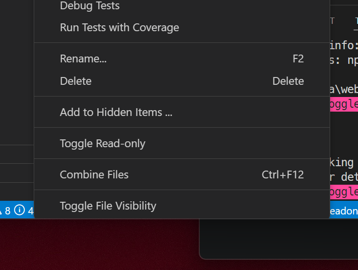

# File Read-only Toggler

This VSCode extension allows you to toggle the read-only status of selected files or folders. It supports multi-selection, allowing you to change the status of multiple items at once.

## Features

- Toggle read-only status for individual files
- Toggle read-only status for folders (applies to all files within)
- Support for multi-selection of files and folders
- Works across different operating systems

## Usage

Right-click on a file or folder in the Explorer view and select "Toggle Read-only" from the context menu. You can also select multiple items before right-clicking to toggle their status simultaneously.

## Screenshots

Below is a screenshot demonstrating the extension in action:

## License

This project is licensed under the MIT License - see the [LICENSE](./LICENSE) file for details.